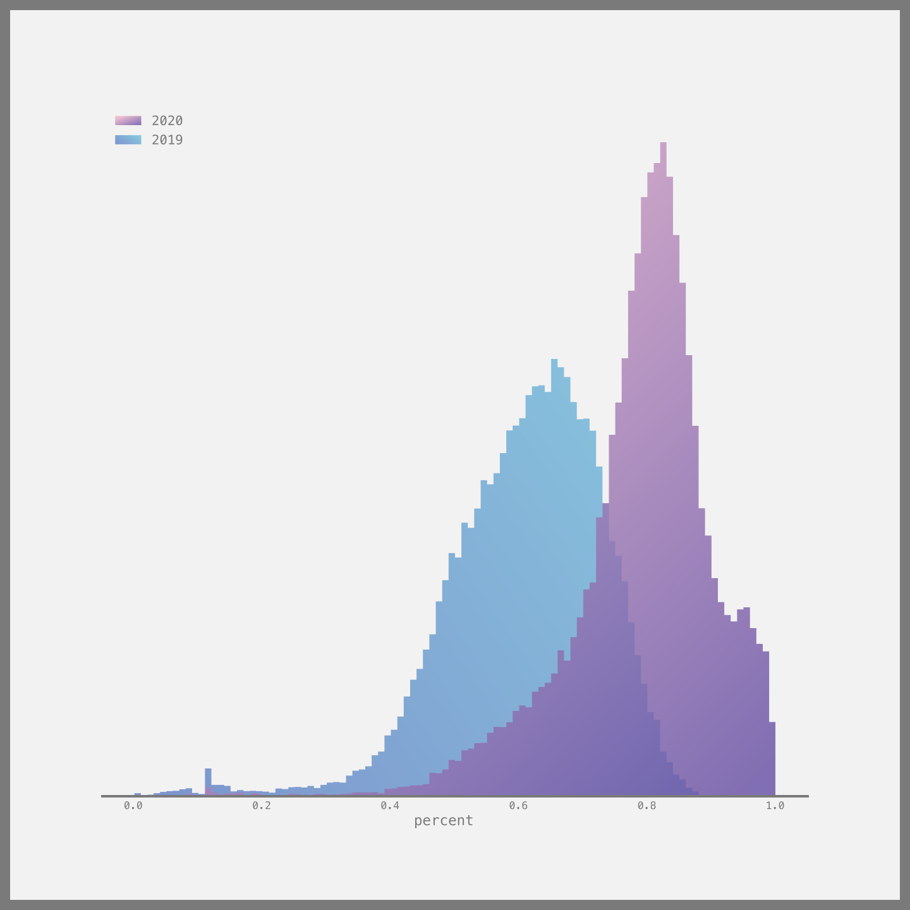

# the_genius_batch

Mumbai University results across a few branches for the years 2019 (pre COVID era), and 2020 (COVID era).

Article: [Mumbai University, Everyone Cheated](https://18alan.medium.com/mumbai-university-everyone-cheated-83320b8c351a)

Source: http://mumresults.in  (2nd April, 2021)

Some points:
- Results for engineering courses have the most data, even individual subject marks have been cleaned into `.csv` files.
- Results for non engineering courses mostly have only *Total Marks* or *GPA* or both.
- Each `.csv` file has an accompanying `.json` file that has some metadata.

---

Some convenience code has been written to interface with the csv data and clean it.

```
from mapper import D

d = D()
```

The above line takes about a minute to run.

The `D` object has access to all 32 `.csv` files in the form of `pd.DataFrame` objects. 

To access a data frame this: `d.y[YY].[course].df` can be used.

The `__repr__` methods of `D`'s attributes gives some meaningful info.

---
*Check the `Plotting It.ipynb` notebook to see how the data is accessed.*